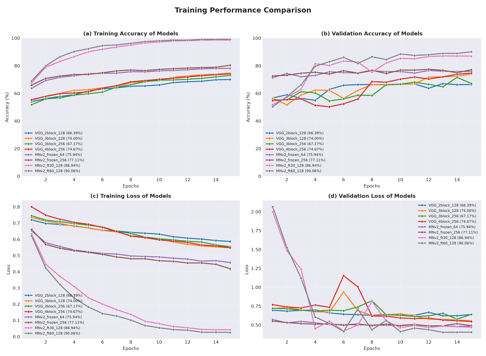
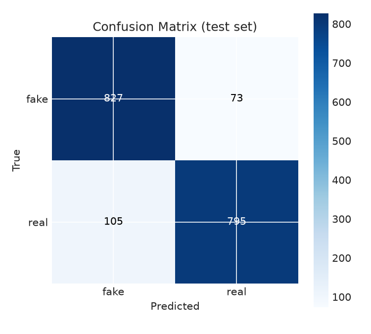
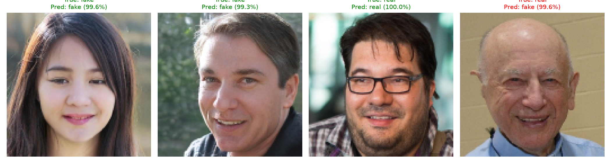

# 🧠 ใบงานที่ 8 — แยกใบหน้า "จริง vs AI สร้าง" ด้วย Deep CNN

**รายวิชา** Machine Learning (04-624-201) · **ภาควิชาวิศวกรรมคอมพิวเตอร์ มทร.ธัญบุรี (RMUTT)**
**หัวข้อ:** DCNN on a Dataset of Your Choice

> **โจทย์ในหนึ่งประโยค:** ให้โมเดลดูรูปใบหน้า แล้วบอกว่าเป็น **คนจริง (real)** หรือ **ใบหน้าที่ AI สร้างขึ้น (fake)**

---

## ⚡ สรุปผลใน 30 วินาที

| | |
|---|---|
| 🏆 **โมเดลที่ดีที่สุด** | `MNv2_ft60_128` (MobileNetV2 + fine-tune) |
| 🎯 **Test accuracy** | **90.11%** (จาก 1,800 รูปที่โมเดลไม่เคยเห็น) |
| ⚖️ **แยก 2 class ได้สมดุล** | F1 ≈ 0.90 ทั้ง fake และ real |
| 🆚 **เทียบ Lab 7 (CNN ธรรมดา)** | 86.83% → **90.11%** (+3.28 จุด) |
| 🛠️ **VGG ที่สร้างเองดีที่สุด** | `VGG_4block_256` 73.78% (baseline เดิม 67.22%) |
| 💡 **ข้อสรุปสำคัญ** | บนข้อมูล 12,000 รูป **pretrained + fine-tune ชนะการเทรนจากศูนย์** อย่างชัดเจน |



> 📌 ตัวเลขใน legend ของกราฟคือ **validation accuracy** ที่ epoch 15 (ใช้เลือกโมเดลที่ดีที่สุด) ส่วนตัวเลขในตารางด้านล่างคือ **test accuracy**

---

## 📚 สารบัญ

1. [Dataset](#1--dataset)
2. [โมเดลที่ทดลอง](#2--โมเดลที่ทดลอง)
3. [การออกแบบการทดลอง](#3--การออกแบบการทดลอง)
4. [ผลการทดลอง](#4--ผลการทดลอง)
5. [เรื่องราวของการปรับปรุงโมเดล (ก่อน → หลัง)](#5--เรื่องราวของการปรับปรุงโมเดล-ก่อน--หลัง)
6. [วิเคราะห์และอภิปรายผล](#6--วิเคราะห์และอภิปรายผล)
7. [ข้อจำกัด](#7--ข้อจำกัด)
8. [โครงสร้างโปรเจกต์และไฟล์ผลลัพธ์](#8--โครงสร้างโปรเจกต์และไฟล์ผลลัพธ์)
9. [วิธีรัน](#9--วิธีรัน)
10. [สภาพแวดล้อมที่ใช้ทดลอง](#10--สภาพแวดล้อมที่ใช้ทดลอง)

---

## 1. 📦 Dataset

ใช้ชุดเดียวกับ Lab 7 เพื่อให้เปรียบเทียบ CNN ธรรมดา (Lab 7) กับ DCNN (Lab 8) ได้อย่างยุติธรรม

| รายการ | ค่า |
|---|---|
| ชื่อชุดข้อมูล | 140k Real and Fake Faces (xhlulu, Kaggle) |
| ประเภทงาน | Binary classification: `real` (ใบหน้าจริง) vs `fake` (สร้างจาก StyleGAN) |
| จำนวนรูปที่ใช้ | 12,000 รูป (6,000 รูป/class) สุ่มจากต้นฉบับ 140,000 รูป |
| ขนาดภาพที่ป้อนโมเดล | 128 × 128 × 3 (RGB) |
| การแบ่งข้อมูล | train 70% / validation 15% / test 15% (stratified, seed = 42) |
| จำนวนรูปหลังแบ่ง | train ≈ 8,400 · validation ≈ 1,800 · test = 1,800 (900 รูป/class) |

---

## 2. 🏗️ โมเดลที่ทดลอง

มี 2 ตระกูล รวม **8 configuration**

### 2.1 VGG-style DCNN (สร้างเองทั้งหมด) — 4 configs

```
Input (128×128×3)
  → Normalization (mean/std จากชุด train)
  → RandomFlip + RandomRotation(0.05)          ← augmentation (เฉพาะตอนเทรน)
  → [ Conv3×3 → BN → ReLU ] ×2 → MaxPool       ← 1 block (ทำซ้ำ N block)
  → Flatten → Dense(neurons, ReLU) → Dropout
  → Dense(2, Softmax)
```

| Config | Conv blocks | Filters | Dense neurons |
|---|:---:|---|:---:|
| `VGG_2block_128` | 2 | 32, 64 | 128 |
| `VGG_3block_128` | 3 | 32, 64, 128 | 128 |
| `VGG_3block_256` | 3 | 32, 64, 128 | 256 |
| `VGG_4block_256` | 4 | 32, 64, 128, 256 | 256 |

### 2.2 Transfer learning ด้วย MobileNetV2 (pretrained บน ImageNet) — 4 configs

```
Input → Rescaling → augmentation → MobileNetV2 → GlobalAveragePooling
      → Dense(N) → Dropout → Dense(2)
```

| Config | วิธีเทรน | Dense head |
|---|---|:---:|
| `MNv2_frozen_64` | freeze backbone ทั้งหมด เทรนเฉพาะ head | 64 |
| `MNv2_frozen_256` | freeze backbone ทั้งหมด เทรนเฉพาะ head | 256 |
| `MNv2_ft30_128` | **fine-tune** ปลดล็อก 30 เลเยอร์สุดท้ายของ backbone | 128 |
| `MNv2_ft60_128` | **fine-tune** ปลดล็อก 60 เลเยอร์สุดท้ายของ backbone | 128 |

---

## 3. 🧪 การออกแบบการทดลอง

| พารามิเตอร์ | ค่า |
|---|---|
| Epoch | เทรน 15 epoch และบันทึก test accuracy ที่ epoch **5, 10, 15** |
| Optimizer / Loss | Adam / sparse categorical crossentropy |
| Batch size | 32 (รันบน GPU ที่มี VRAM 6 GB) |
| เกณฑ์เลือกโมเดลที่ดีที่สุด | validation accuracy ที่ epoch 15 |
| ตัวชี้วัด | accuracy, precision, recall, F1-score, confusion matrix |

---

## 4. 📊 ผลการทดลอง

### 4.1 Test accuracy ของทุก config

| อันดับ | Config | Epoch 5 | Epoch 10 | Epoch 15 |
|:---:|---|:---:|:---:|:---:|
| 🥇 | **`MNv2_ft60_128`** | 0.8322 | 0.8867 | **0.9011** |
| 🥈 | `MNv2_ft30_128` | 0.7994 | 0.8650 | 0.8767 |
| 3 | `MNv2_frozen_64` | 0.7394 | 0.7489 | 0.7617 |
| 4 | `MNv2_frozen_256` | 0.7339 | 0.7561 | 0.7578 |
| 5 | `VGG_4block_256` | 0.5128 | 0.7111 | 0.7378 |
| 6 | `VGG_3block_128` | 0.6261 | 0.6628 | 0.7178 |
| 7 | `VGG_2block_128` | 0.6383 | 0.6750 | 0.6683 |
| 8 | `VGG_3block_256` | 0.5461 | 0.6722 | 0.6633 |

### 4.2 โมเดลที่ดีที่สุด: `MNv2_ft60_128`

| Class | Precision | Recall | F1-score | Support |
|---|:---:|:---:|:---:|:---:|
| fake | 0.8873 | 0.9189 | 0.9028 | 900 |
| real | 0.9159 | 0.8833 | 0.8993 | 900 |
| **macro avg** | 0.9016 | 0.9011 | **0.9011** | 1,800 |



### 4.3 ลองทำนายภาพสุ่มจากชุด test



---

## 5. 🔄 เรื่องราวของการปรับปรุงโมเดล (ก่อน → หลัง)

**รอบที่ 1 (baseline)** ผลไม่ค่อยดี: โมเดลตื้นสุดไม่เรียนรู้ โมเดลลึกสุดไม่เสถียร และโมเดลเอนเอียงไปทายว่า "real"

**รอบที่ 2** ปรับ 4 อย่างพร้อมกัน แล้วเพิ่มกลุ่ม transfer learning:

| การปรับปรุง | เหตุผล |
|---|---|
| L2 regularization (1e-4) ที่ชั้น Conv และ Dense | ลด overfit / ความไม่เสถียรของโมเดลลึก |
| Dropout 0.5 → 0.6 | ลด overfit เพิ่ม |
| Learning rate 1e-3 → 5e-4 | ให้การเทรนนิ่งขึ้น |
| `ReduceLROnPlateau` (factor 0.5, patience 3) | ลด LR เมื่อ val loss ไม่ดีขึ้น โดยไม่หยุดเทรนก่อนกำหนด |
| เพิ่ม MobileNetV2 (frozen และ fine-tune) | เทียบ "เทรนจากศูนย์" กับ "ใช้ pretrained weights" |

**VGG ที่สร้างเอง: test accuracy ที่ epoch 15 ก่อนและหลัง**

| Config | ก่อน (baseline) | หลังปรับปรุง | เปลี่ยนแปลง |
|---|:---:|:---:|:---:|
| `VGG_2block_128` | 0.5000 | 0.6683 | ▲ +16.83 |
| `VGG_3block_128` | 0.6622 | 0.7178 | ▲ +5.56 |
| `VGG_3block_256` | 0.6722 | 0.6633 | ▼ −0.89 |
| `VGG_4block_256` | 0.5367 | 0.7378 | ▲ +20.11 |
| **ตัวที่ดีที่สุดของกลุ่ม** | 0.6722 (`3block_256`) | **0.7378** (`4block_256`) | ▲ +6.56 |

> ⚠️ ทั้ง 4 อย่างถูกปรับพร้อมกัน จึงบอกไม่ได้ว่าอย่างไหนช่วยมากที่สุด (ยังไม่ได้ทดลองแยกตัวแปร)

---

## 6. 🔍 วิเคราะห์และอภิปรายผล

### 6.1 Pretrained + fine-tune ชนะการเทรนจากศูนย์
บนข้อมูลเพียง 12,000 รูป โมเดลที่เทรนจากศูนย์ทำได้สูงสุด 73.78% ขณะที่ MobileNetV2 แม้ freeze backbone ไว้ก็ได้ 75.8–76.2% แล้ว และเมื่อ **ปลดล็อกเลเยอร์ของ backbone ให้ปรับตามงานนี้** ผลก็พุ่งเป็น 87.67% (30 เลเยอร์) และ 90.11% (60 เลเยอร์) สะท้อนว่า feature ที่เรียนรู้จาก ImageNet มีประโยชน์ และการปรับ backbone ให้เข้ากับงาน (แยกร่องรอยของภาพที่ AI สร้าง) ช่วยได้มาก

### 6.2 ยิ่งปรับ backbone มาก ยิ่งดี (ในช่วงที่ทดลอง)
`frozen` (≈76%) → `ft30` (87.67%) → `ft60` (90.11%) ส่วนจำนวน neuron ใน head (64 เทียบกับ 256) แทบไม่ต่างกัน (76.17% เทียบกับ 75.78%) และความต่างระดับนี้อยู่ในช่วงความคลาดเคลื่อนของการวัด

### 6.3 โมเดลที่ fine-tune มี overfitting แต่ยังดีที่สุด
จากกราฟ `ft60` และ `ft30` มี train accuracy ราว 99% และ 98.5% แต่ val accuracy อยู่ราว 90% และ 87% โดย train loss ลงถึง ~0.03 ขณะที่ val loss นิ่งราว 0.4–0.5 แปลว่ามีช่องว่างระหว่างชุด train กับ val ชัดเจน (วิธีแก้ที่น่าลอง: augmentation เพิ่ม, dropout/L2 สูงขึ้น หรือใช้ early stopping)

### 6.4 VGG ที่สร้างเอง เทรนช้าและแกว่ง
train accuracy ขึ้นช้า (ราว 70–75% ที่ epoch 15) และ val accuracy แกว่ง โดยเฉพาะ `VGG_4block_256` ที่ val loss พุ่งถึง ~1.15 ที่ epoch 6 ก่อนกลับลงมา ซึ่งเป็นอาการเทรนไม่เสถียรของโมเดลลึกที่เริ่มจากศูนย์

### 6.5 `VGG_2block_128` ไม่เรียนรู้ในรอบแรก แต่ฟื้นในรอบสอง
baseline ได้ 50% (เดาสุ่ม) ตลอด สันนิษฐานว่าเพราะ pooling เพียง 2 ครั้ง ทำให้ชั้น Dense แรกมีพารามิเตอร์ราว 8.4 ล้านตัว และเทรนยากที่ learning rate เดิม หลังปรับปรุงโมเดลเรียนรู้ได้ (66.83%) แสดงว่าปัญหาน่าจะอยู่ที่การเทรนมากกว่าโครงสร้างอย่างเดียว *(เป็นข้อสันนิษฐาน ยังไม่ได้ทดสอบแยกตัวแปร)*

### 6.6 ความเอนเอียงต่อ class "real" หายไป
ใน baseline โมเดลที่ดีที่สุดมี recall ของ `fake` เพียง 46.67% (ภาพปลอมเกินครึ่งถูกทายว่าจริง) ส่วนโมเดลที่ดีที่สุดตอนนี้ได้ recall ของ `fake` = 91.89% และ `real` = 88.33% จึงสมดุลกว่ามาก สำคัญหากนำไปใช้ตรวจจับ deepfake จริง

### 6.7 เทียบกับ Lab 7 (ชุดข้อมูลเดียวกัน)

| | Lab 7 (CNN) | Lab 8 baseline (DCNN) | Lab 8 ดีที่สุด (MobileNetV2 ft60) |
|---|:---:|:---:|:---:|
| Test accuracy | 86.83% | 67.22% | **90.11%** |

DCNN ที่ลึกกว่าไม่ได้ดีกว่าโดยอัตโนมัติ: VGG ที่เทรนจากศูนย์ (ดีที่สุด 73.78%) ยังต่ำกว่า CNN ของ Lab 7 สาเหตุที่น่าจะมีผล ได้แก่ Lab 7 มี early stopping ที่คืนค่า weight ที่ดีที่สุด, Lab 8 ใช้ augmentation ทำให้เทรนยากขึ้น และ 15 epoch อาจยังไม่พอ *(เป็นข้อสันนิษฐานจากความต่างของการตั้งค่า ยังไม่ได้ทดลองแยกปัจจัย)* ส่วนโมเดล transfer learning ที่ดีที่สุดชนะ Lab 7 ไป 3.28 จุด

### 6.8 สรุป
การเพิ่มความลึกอย่างเดียวไม่รับประกันว่าจะดีขึ้น สำหรับชุดข้อมูลขนาดนี้ **การใช้ pretrained weights ร่วมกับ fine-tuning** ให้ผลดีที่สุด (90.11%) และจำแนก real/fake ได้สมดุล config ที่ดีที่สุดยังมีแนวโน้มดีขึ้นเมื่อเพิ่ม epoch (83.22% → 88.67% → 90.11%) แสดงว่าที่ 15 epoch อาจยังไม่อิ่มตัว

---

## 7. ⚠️ ข้อจำกัด

- **รันครั้งเดียวต่อ config** (seed เดียว) ยังไม่ได้ทำซ้ำเพื่อดูความแปรปรวน
- **ชุด test มี 1,800 รูป** ความคลาดเคลื่อนของ accuracy ประมาณ ±1.4 จุด (ความเชื่อมั่น 95%) ความต่างระดับ 1 จุด เช่น `MNv2_frozen_64` เทียบกับ `MNv2_frozen_256` จึงไม่ควรตีความว่ามีนัยสำคัญ
- **การปรับปรุงหลายอย่างทำพร้อมกัน** จึงแยกผลของแต่ละอย่างไม่ได้
- ใช้ข้อมูล 12,000 จาก 140,000 รูป การใช้ข้อมูลมากขึ้นอาจเปลี่ยนผลได้ โดยเฉพาะกับโมเดลที่เทรนจากศูนย์
- ผลแสดงบนใบหน้าที่สร้างจาก StyleGAN ชุดนี้เท่านั้น ยังไม่ได้ทดสอบกับภาพที่สร้างจากเครื่องมืออื่น

---

## 8. 🗂️ โครงสร้างโปรเจกต์และไฟล์ผลลัพธ์

```
ML-LAB08/
├── classification/
│   ├── main.py             # pipeline หลัก: เทรนและเปรียบเทียบทุก config
│   ├── data_loader.py      # โหลดรูปจากโฟลเดอร์ย่อย (1 โฟลเดอร์ = 1 class) ข้ามไฟล์เสีย
│   ├── preprocessing.py    # resize + แปลงสี
│   ├── split_data.py       # แบ่ง train/val/test แบบ stratified
│   ├── vgg_model.py        # สร้างโมเดล (VGG-style และ transfer learning) + เทรน
│   ├── evaluate.py         # accuracy, classification report, confusion matrix, กราฟ
│   ├── test_vgg.py         # ทำนายภาพสุ่ม 4 รูปจากชุด test
│   └── outputs/            # ผลลัพธ์ทั้งหมด
└── requirements.txt
```

**Data flow:** โหลดรูป → preprocess → แบ่ง train/val/test → เทรนทุก config (บันทึก test accuracy ที่ epoch 5/10/15) → เลือก config ที่ดีที่สุดจาก validation accuracy → ประเมินบนชุด test → สร้างกราฟและรายงาน

| ไฟล์ใน `outputs/` | เนื้อหา |
|---|---|
| `comparison_results.json` / `.csv` | accuracy ของทุก config ที่แต่ละ epoch |
| `comparison_epochs.png` | test accuracy เทียบจำนวน epoch ของแต่ละ config |
| `comparison_overlay.png` | เปรียบเทียบทุก config ในกราฟเดียว 4 panel (train/val accuracy และ loss) |
| `training_history.png`, `history.json` | กราฟและค่า accuracy/loss ต่อ epoch ของแต่ละ config |
| `confusion_matrix.png`, `classification_report.txt` | ผลประเมินของโมเดลที่ดีที่สุดบนชุด test |
| `vgg_model.keras` | โมเดลที่ดีที่สุด |
| `prediction_sample.png` | ผลทำนายภาพสุ่ม 4 รูป (จาก `test_vgg.py`) |

> ไฟล์ `.npy` และ `classes.json` ใน `outputs/` เป็น cache ของข้อมูลที่โหลดแล้ว ใช้กับ `--reuse-data` เท่านั้น

---

## 9. ▶️ วิธีรัน

### 9.1 บน GPU ด้วย WSL2 (แนะนำ)

TensorFlow บน Windows ใช้ GPU ตรงๆ ไม่ได้ ต้องรันผ่าน WSL2 (Ubuntu) และต้องมี NVIDIA driver ฝั่ง Windows

```bash
# ใน Ubuntu (WSL) — เช็คว่ามองเห็น GPU
nvidia-smi

# สร้าง venv (แนะนำ Python 3.12) และติดตั้ง
sudo apt update && sudo apt install -y rsync curl
curl -LsSf https://astral.sh/uv/install.sh | sh && source $HOME/.local/bin/env
mkdir -p ~/ML-LAB08
rsync -a --exclude venv --exclude __pycache__ "/mnt/c/<path>/ML-LAB08/" ~/ML-LAB08/
cd ~/ML-LAB08
uv venv --python 3.12 venv && source venv/bin/activate
uv pip install "tensorflow[and-cuda]" numpy pandas matplotlib scikit-learn pillow opencv-python-headless

# ชี้ path ของไลบรารี CUDA ใน venv (ทำให้ถาวรด้วย echo ... >> venv/bin/activate)
export LD_LIBRARY_PATH=$(find "$VIRTUAL_ENV/lib" -path "*nvidia/*/lib" -type d | paste -sd:):$LD_LIBRARY_PATH

# เช็คว่า TensorFlow เห็น GPU (ต้องไม่ได้ [])
python -c "import tensorflow as tf; print(tf.config.list_physical_devices('GPU'))"
```

### 9.2 รัน pipeline

```bash
cd ~/ML-LAB08/classification
python main.py --data-dir "<path>/DATASET" --img-size 128 --max-per-class 6000 --epochs 5 10 15 --batch-size 32

# ทำนายภาพสุ่ม 4 รูป
python test_vgg.py
```

`--data-dir` ต้องชี้ไปโฟลเดอร์ที่มี `real/` และ `fake/`

| ตัวเลือก | ความหมาย |
|---|---|
| `--configs <ชื่อ ...>` | เลือกรันเฉพาะบาง config (ผลเปรียบเทียบจะมีเฉพาะที่เลือก) |
| `--reuse-data` | ใช้ไฟล์ `.npy` เดิมใน `outputs/` ข้ามขั้นโหลดรูป |
| `--batch-size` | ขนาด batch (ถ้า VRAM ไม่พอ ลองลดเป็น 16) |

### 9.3 บน CPU (Windows) — ช้ากว่ามาก

```powershell
py -3.12 -m venv venv
venv\Scripts\Activate.ps1
pip install -r requirements.txt
cd classification
python main.py --data-dir "<path>\DATASET" --img-size 128 --max-per-class 6000 --epochs 5 10 15
```

---

## 10. 💻 สภาพแวดล้อมที่ใช้ทดลอง

- Windows + **WSL2 (Ubuntu)**, Python 3.12, TensorFlow (ติดตั้งแบบ `tensorflow[and-cuda]`)
- เทรนบน **GPU: NVIDIA GeForce RTX 3050 (VRAM 6 GB)**
- Batch size 32, ขนาดภาพ 128 × 128

---

<sub>ใบงานที่ 8 · Machine Learning (04-624-201) · ภาควิชาวิศวกรรมคอมพิวเตอร์ คณะวิศวกรรมศาสตร์ มหาวิทยาลัยเทคโนโลยีราชมงคลธัญบุรี</sub>
